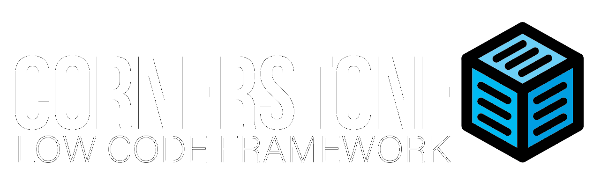

  

## Introduction

Cornerstone is a low-code, off-line capable, cloud-connected, multi-platform framework that allows building apps in a fraction of the time that work on all devices

This repo is for distributing cornerstone sdk's while in beta

Note: these instructions will change once the packages and tools go live on nuget

Please see the wiki for instructions on how to use Cornerstone:
[Wiki](https://github.com/AdaptableApps/cornerstone.wiki)